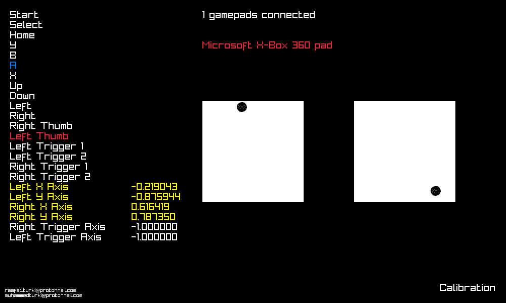

# JoyScan

Because broken controllers suck

just to make sure all your buttons are working & giving the right values

### Controls
| key         | action                              |
| -           | -                                   |
| Up & Down   | cycle through connected controllers |
| Q           | quit                                |

### Building
this was made in raylib so it should be cross platform however it's only tested on linux so far.

raylib must be on your system
```shell
make
./joyscan
```



### Contribute
PRs are welcome
